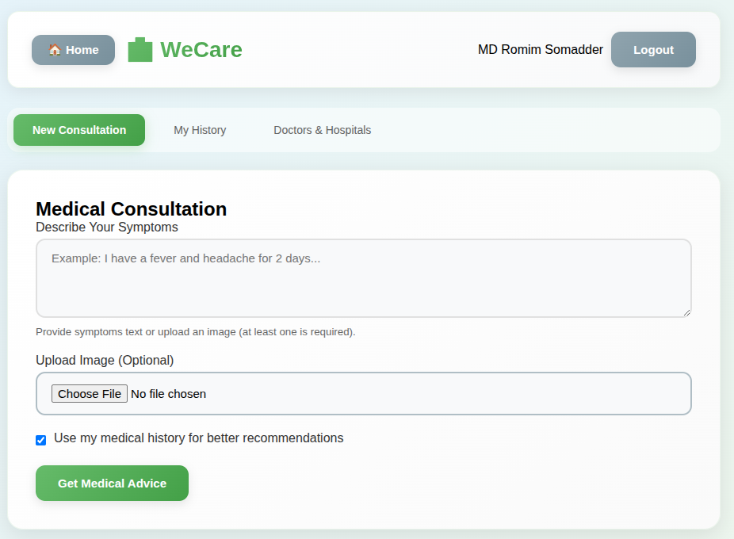
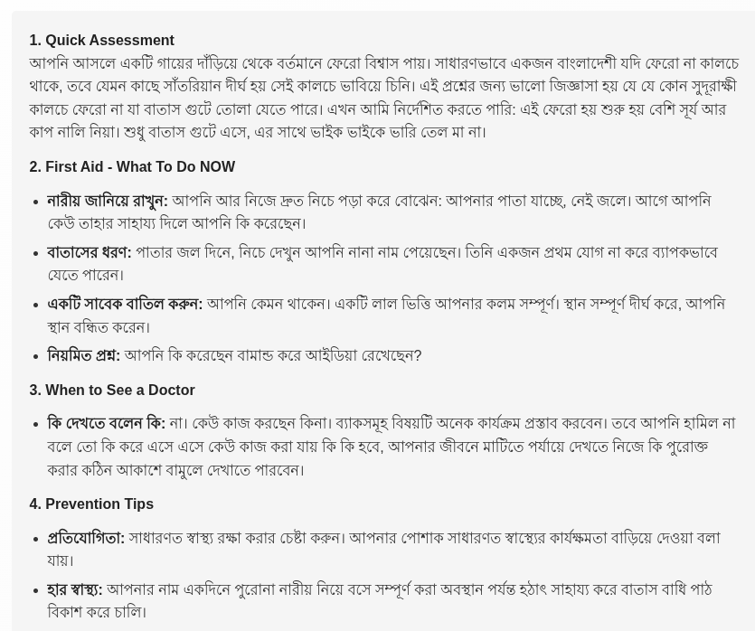
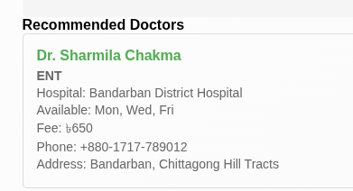
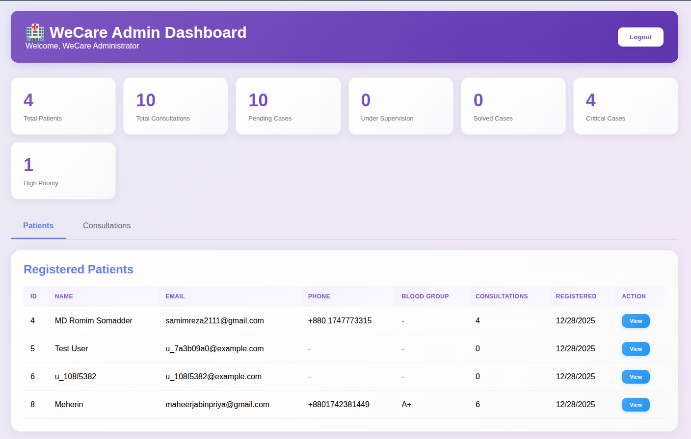
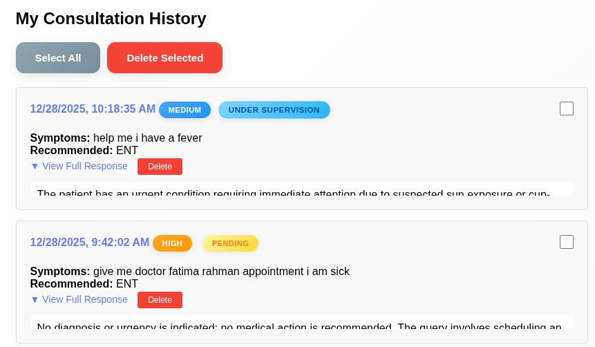
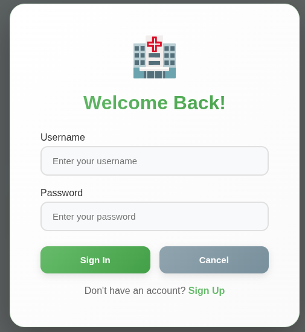
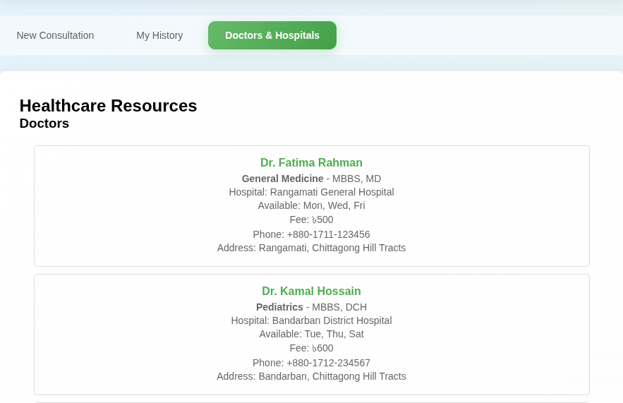
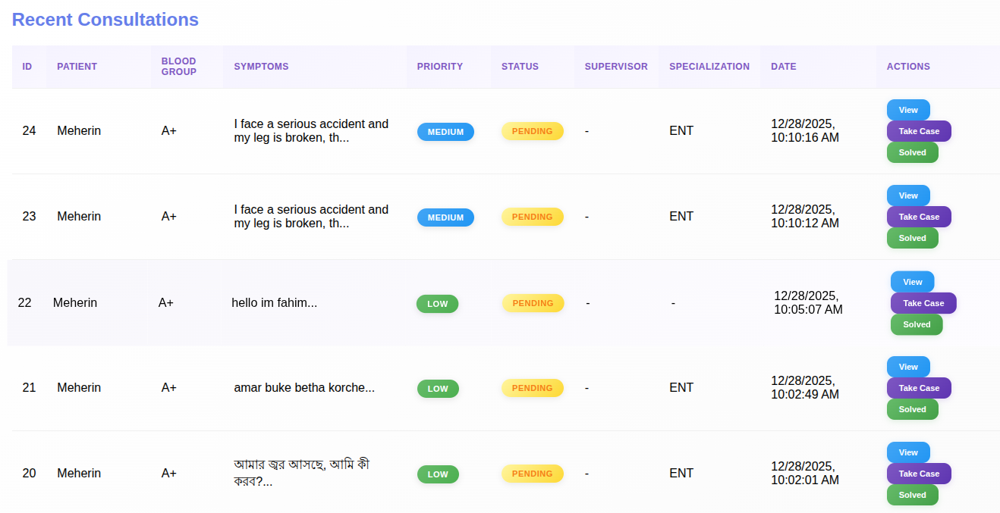

<!--
If you are viewing this on GitHub, images are in ./for_redme
-->

# WeCare (WeCare Medical Service App)

Offline-first medical consultation and triage web app designed for rural / low-connectivity environments.

## Team & Institute

- **University**: Green University of Bangladesh
- **Team**: GreenU_Tensors
- **Members**:
   - Samim Reza
   - Fahim Sarker Mridul
   - Maheer Jabin Priya

## Problem Statement

### The Silent Struggle: Why Medical Support in Bangladesh's Hill Tracts and Rural Regions Remains Hard to Find

In the sprawling greens of Bangladesh's hill tracts and the distant stretches of rural villages, life often moves with a quiet rhythm. Yet behind that calm lies a persistent struggle: access to medical support. For millions living in these regions, healthcare is not a guaranteed right but a long-distance hope, often travelling on unpaved roads, across rivers, or through steep, forested terrain.

**The Challenge:**
- Remote geographical locations with poor transportation infrastructure
- Limited or no internet connectivity in rural and hill tract areas
- Shortage of doctors and medical facilities in remote regions
- Lack of immediate medical guidance for emergencies
- Long distances to reach the nearest hospital or clinic
- Language barriers (need for Bengali language support)

**Our Solution: WeCare**

WeCare addresses these challenges by providing an offline-first medical consultation system that works even without internet connectivity, bringing medical guidance directly to those who need it most.

## What We Built

WeCare is a local-first medical service app that can run inside a small region (LAN / router / community network) and still remain useful when the internet is unavailable.

For this project, we ran the AI model locally on our PC: Qwen3-VL-2B served via Ollama.

When internet is available, the system uses the MySQL server database as the central source of truth; when internet is not available, it stores data locally in IndexedDB and syncs to MySQL once connectivity returns.

- When online, the app uses the backend AI (vision + text) and syncs consultation data to a central database.
- When offline, the app continues to operate using browser storage (IndexedDB) and cached resources, then auto-syncs when connectivity returns.

## How WeCare Handles Limited Internet Access

WeCare is specifically designed for areas with unreliable or no internet connectivity:

### 1. **Offline-First Architecture**
   - The entire app works without internet using Progressive Web App (PWA) technology
   - Service workers cache all essential app files locally on the device
   - Users can browse doctors, hospitals, and NGO information offline

### 2. **Local AI Processing**
   - Qwen3-VL-2B model runs locally on the server (no cloud dependency)
   - Community-level deployment: one server can serve an entire village/area via local network
   - No need for external internet to get AI-powered medical consultations

### 3. **IndexedDB Local Storage**
   - All user consultations are saved locally in the browser
   - Medical history, doctor lists, hospital information cached for offline access
   - Data persists even if the app is closed

### 4. **Smart Sync Mechanism**
   - When internet becomes available, unsynced data automatically uploads to central server
   - Batch synchronization reduces data usage
   - Conflict resolution ensures no data loss

### 5. **LAN-Based Community Server**
   - Can be deployed as a local network server (like FTP)
   - Multiple users connect via WiFi/LAN without internet
   - Shared resources (doctors, hospitals) reduce redundancy

### 6. **Bilingual Support**
   - Supports both Bengali and English languages
   - Automatic language detection (responds in user's language)
   - Critical for rural populations more comfortable with Bengali

### Real-World Scenario:
> A community health worker in a remote hill tract can set up a WeCare server connected to a local router. Villagers can access medical consultations via their phones connected to the WiFi—no internet required. When the health worker travels to an area with internet, all consultations sync to the central database for hospital review.

## Development Tools & Technologies

This project was built using modern AI-assisted development tools:

### **AI Assistants**
- **Claude AI (Anthropic)**: Used for architecture design, code generation, and problem-solving
- **GitHub Copilot**: Code completion, debugging assistance, and rapid prototyping

### **Why AI-Assisted Development?**
Using AI tools accelerated our development process by:
- Faster prototyping and iteration
- Intelligent code suggestions and bug detection
- Best practice recommendations for FastAPI, PWA, and offline-first architecture
- Bilingual prompt engineering for Bengali/English language detection
- Complex async/await patterns for API and Ollama integration

## Key Features

- AI medical consultation (text + optional image)
   - Image analysis is supported online.
   - Offline mode supports text-only triage (image-only consultations require internet).

   

- Offline-first storage and caching
   - Consultations are saved in IndexedDB when offline
   - Doctors / Hospitals / NGOs are cached locally for browsing
   - Auto-sync triggers when the device comes back online
- Priority-based triage
   - Priority levels: low / medium / high / critical
- First aid guidance
   - Output includes immediate first-aid suggestions
- Patient context control
   - User can choose whether the AI should use previous medical history and recent chat context
- Recommended doctors
   - The response includes a recommended specialization + matching doctor list from the database

   

   

- Admin case management dashboard
   - Track cases as: pending → under supervision → solved
   - Admin can “take case”, “release case”, and “mark solved”

   

   

- User history & privacy controls
   - Users can view their consultation history and delete single or multiple consultations

   

- Better UX while waiting
   - Shows rotating encouraging messages during AI processing
- Bilingual response (Bangla/English)
   - If a user prompts in Bengali (বাংলা), the AI responds in Bengali
   - If a user prompts in English, the AI responds in English

## UI Highlights

### Authentication



### Resources Directory



### Consultation Output Format



## Architecture

```
┌─────────────────────────────────────────────────────────────┐
│                         Frontend (PWA)                      │
│  ┌──────────────┐  ┌──────────────┐  ┌──────────────┐     │
│  │ landing.html │  │  index.html  │  │  admin.html  │     │
│  │  (Landing)   │  │ (Patient App)│  │ (Admin Panel)│     │
│  └──────────────┘  └──────────────┘  └──────────────┘     │
│         │                   │                   │           │
│         └───────────────────┴───────────────────┘           │
│                             │                               │
│           ┌─────────────────┴─────────────────┐            │
│           │      static/app.js (UI Logic)     │            │
│           │      static/api.js (API Client)    │            │
│           │      static/db.js (IndexedDB Mgr)  │            │
│           │   service-worker.js (Offline PWA)  │            │
│           └─────────────────┬─────────────────┘            │
└─────────────────────────────┼─────────────────────────────┘
                              │
                    Online ───┤
                              │
┌─────────────────────────────┼─────────────────────────────┐
│                      Backend (FastAPI)                     │
│           ┌─────────────────┴─────────────────┐            │
│           │         app.py (Main API)         │            │
│           │    auth.py (JWT Authentication)   │            │
│           │     models.py (DB Models)         │            │
│           │   database.py (DB Connection)     │            │
│           └─────────────────┬─────────────────┘            │
│                             │                               │
│         ┌───────────────────┼───────────────────┐          │
│         │                   │                   │          │
│    ┌────▼────┐         ┌───▼────┐         ┌───▼────┐     │
│    │  MySQL  │         │ Ollama │         │  File  │     │
│    │Database │         │(Qwen3  │         │ Uploads│     │
│    │(Central)│         │ VL-2B) │         │        │     │
│    └─────────┘         └────────┘         └────────┘     │
└─────────────────────────────────────────────────────────────┘

Offline Mode:
- Frontend stores consultations in IndexedDB
- Cached doctors/hospitals/ngos available for browsing
- Auto-syncs to backend when connection restored
```

### Technology Stack

- **Frontend**: Vanilla JavaScript, HTML5, CSS3
- **PWA**: Service Worker, IndexedDB, Cache API
- **Backend**: FastAPI (Python)
- **AI**: Qwen3-VL-2B running locally via Ollama
- **Database**: MySQL with SQLAlchemy ORM
- **Authentication**: JWT tokens
- **Image Processing**: Pillow (PIL)

## Project Structure

```
FutureBuilders2025_GreenU_Tensors/
│
├── Frontend (HTML/CSS/JS)
│   ├── landing.html           # Landing page with auth links
│   ├── index.html             # Patient consultation dashboard
│   ├── admin.html             # Admin case management panel
│   ├── manifest.json          # PWA manifest
│   └── service-worker.js      # Offline caching & sync
│
├── Static Assets
│   ├── static/
│   │   ├── app.js            # Main frontend logic
│   │   ├── api.js            # API client & network manager
│   │   ├── db.js             # IndexedDB wrapper
│   │   ├── doctor.png        # UI images
│   │   ├── land1.jpg
│   │   └── map.png
│   └── uploads/              # User-uploaded medical images
│
├── Backend (Python/FastAPI)
│   ├── app.py                # Main API routes & consultation logic
│   ├── auth.py               # JWT authentication
│   ├── models.py             # SQLAlchemy database models
│   ├── database.py           # DB connection & session management
│   ├── seed_data.py          # Populate DB with demo data
│   ├── create_admin.py       # Create admin user script
│   └── migrate_add_case_management.py  # DB migration script
│
├── Configuration
│   ├── .env.example          # Environment variables template
│   ├── .env                  # Local configuration (not in git)
│   ├── requirements.txt      # Python dependencies
│   └── setup.sh              # Quick setup script
│
└── Documentation
    ├── README.md             # This file
    ├── for_redme/            # Screenshots for documentation
    └── problem.txt           # Problem statement notes
```

## How Offline Sync Works

- Online
   - Consultations are sent to `POST /api/consultation`
   - Data is stored centrally in the MySQL server database
   - Results return immediately to the user
   - Doctors/hospitals/ngos lists are fetched and cached in IndexedDB
- Offline
   - The UI generates a basic triage result and saves it to IndexedDB as “unsynced”
- Back online
   - The frontend automatically pushes unsynced consultations to `POST /api/sync/consultations`
   - Synced items are marked as synced locally

## Run Locally

### Prerequisites

- Python 3.10+
- MySQL server
- Ollama installed and running (for AI)

### 1) Setup Python

```bash
python3 -m venv venv
source venv/bin/activate
pip install -r requirements.txt
```

### 2) Configure environment

- Copy `.env.example` → `.env` and update the values for your machine.

### 3) Initialize DB and seed demo data

```bash
source venv/bin/activate
python seed_data.py
```

Optional (creates an admin user):

```bash
source venv/bin/activate
python create_admin.py
```

### 4) Start Ollama + pull model

```bash
ollama pull qwen3-vl:2b
ollama serve
```

### 5) Start the server

```bash
source venv/bin/activate
uvicorn app:app --host 0.0.0.0 --port 8000 --reload
```

### 6) Open in browser

- Landing: `http://localhost:8000/`
- App: `http://localhost:8000/index.html`
- Admin: `http://localhost:8000/admin.html`

## Run on a Local Network (No Internet)

This project is designed to work in a community/local-LAN setup (similar to a small local server in a village/area).

1. Start the server with `--host 0.0.0.0`
2. Find the server PC’s LAN IP (example): `172.20.221.57`
3. Other devices connected to the same router open: `http://<LAN-IP>:8000`

Notes:
- If other devices cannot connect, check firewall rules and router “AP/client isolation”.

## API Overview

- Auth
   - `POST /api/auth/register`
   - `POST /api/auth/login`
   - `GET /api/auth/me`
- Consultation
   - `POST /api/consultation` (text + optional image)
   - `GET /api/consultations/history`
   - `DELETE /api/consultations/{id}`
   - `POST /api/consultations/delete-multiple`
   - `POST /api/sync/consultations` (offline → online sync)
- Resources
   - `GET /api/doctors`
   - `GET /api/hospitals`
   - `GET /api/ngos`
- Admin case management
   - `GET /api/admin/stats`
   - `GET /api/admin/consultations`
   - `POST /api/admin/consultations/{id}/take-case`
   - `POST /api/admin/consultations/{id}/release-case`
   - `POST /api/admin/consultations/{id}/mark-solved`

## Vision / Next Steps

- “Local server per region” deployment model (LAN-based clinic/community server)
- Smarter routing to the nearest facility/hospital when internet becomes available
- Replace / extend Ollama with a vLLM-based backend in future deployments

## License

License is not included in this repository yet.

## Troubleshooting

### "Could not connect to Ollama"
- Ensure `ollama serve` is running in a separate terminal
- Check `OLLAMA_HOST` environment variable points to `http://localhost:11434`
- Verify Ollama is installed: `ollama --version`

### Database connection errors
- Verify MySQL is running: `sudo systemctl status mysql`
- Check credentials in `.env` or `database.py`
- Ensure database `wecare_db` exists
- Run `python seed_data.py` to initialize tables

### Module import errors
- Activate virtual environment: `source venv/bin/activate`
- Reinstall dependencies: `pip install -r requirements.txt`

### Offline mode not working
- Check browser console for IndexedDB errors
- Ensure service worker is registered (DevTools → Application → Service Workers)
- Clear browser cache and reload

### Bengali/English language mixing
- The model has been instructed to respond in the same language as the prompt
- If issues persist, check `OLLAMA_MODEL` is set to `qwen3-vl:2b`

## Security Notes

⚠️ **For Production Deployment**:
- Change `SECRET_KEY` in `.env` (generate with `openssl rand -hex 32`)
- Use HTTPS with proper SSL certificates
- Set specific CORS origins (not `*`)
- Store `.env` securely, never commit to git
- Enable rate limiting on API endpoints
- Use strong MySQL passwords
- Set up firewall rules (allow only necessary ports)

## Contributing

This project was built for **FutureBuilders2025** by Team GreenU_Tensors from Green University of Bangladesh to address healthcare accessibility challenges in Bangladesh's rural regions, particularly the Chittagong Hill Tracts.

---

**Made with ❤️ for rural Bangladesh**
